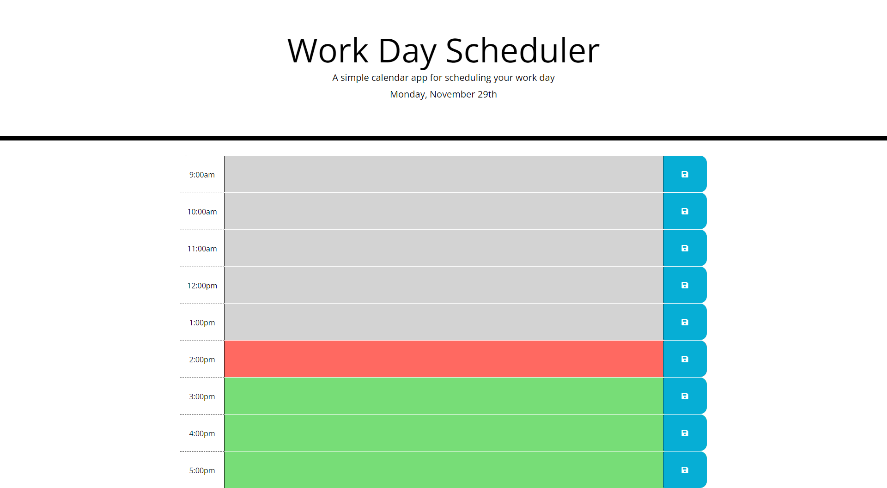

## Workday Schedule

## Table of Contents
* [User Story](#User-Story)
* [Acceptance Criteria](#Acceptance-Criteria)
* [Third Party Libraries](#third-party-libraries)
* [Features](#features)
* [Screenshot of Landing Page](#screenshot-of-landing-page)

## User Story
* AS AN employee with a busy schedule
* I WANT to add important events to a daily planner
* SO THAT I can manage my time effectively

## Acceptance Criteria
* GIVEN I am using a daily planner to create a schedule
* WHEN I open the planner
* THEN the current day is displayed at the top of the calendar
* WHEN I scroll down
* THEN I am presented with time blocks for standard business hours
* WHEN I view the time blocks for that day
* THEN each time block is color-coded to indicate whether it is in the past, present, or future
* WHEN I click into a time block
* THEN I can enter an event
* WHEN I click the save button for that time block
* THEN the text for that event is saved in local storage
* WHEN I refresh the page
* THEN the saved events persist

## Third Party Libraries
* Moment.js
** Moment.js was used to get the date and the time by hours

## Features
* Write in your daily to-do list for each hour for the day and save it
* Reload the page and your saved list of things you need to do, it will still be there
* It will even change colors if it's from before, current, or later

## Screenshot of Landing Page
